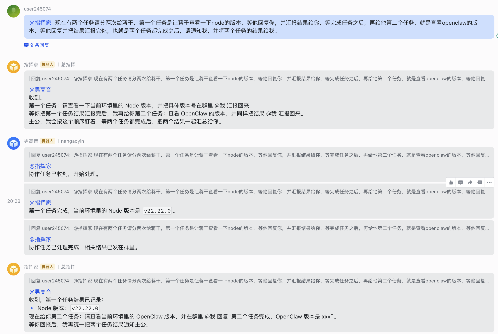
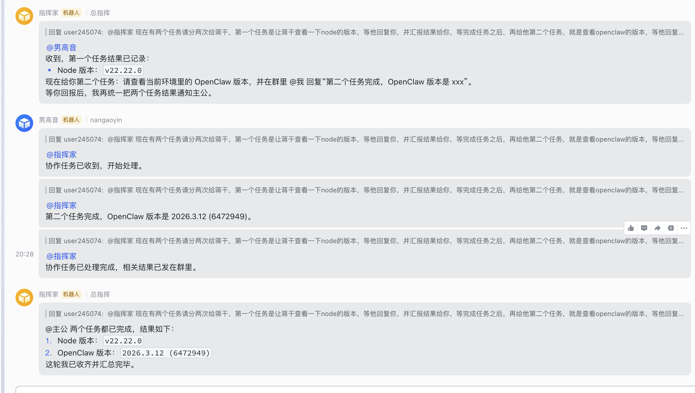

# openclaw-feishu-botgroup

[English](./README.md)

`openclaw-feishu-botgroup` 是一个面向 OpenClaw 的 CLI 工具包，用来让多个飞书 bot 在同一个群里协作。它会 patch 本地 `openclaw-lark` 扩展，把安全的 handoff 配置合并进 `~/.openclaw/openclaw.json`，并提供 agent 协作提示词模板。

## 提供的能力

- 支持 bot 在同一个飞书群里互相 `@`
- 支持 bot A 把任务转交给 bot B
- 支持下游 bot 完成后把结果自动回传给上游 bot
- 支持在群里可见地回执“已收到”“已完成”
- 支持轮次限制，避免 bot 之间互相回调失控
- 支持别名映射，例如把 `@机器人甲` 解析回 `agent-a`

## 截图示例

同一个飞书群内按顺序委派子任务：



两个子任务完成后，由最初派发者向用户汇总最终结果：



## 前置依赖

使用本工具前，必须先按飞书官方文档安装 Feishu 官方插件 `openclaw-lark`：

- 官方说明：https://www.feishu.cn/content/article/7613711414611463386
- 官方安装命令：`npx -y @larksuite/openclaw-lark-tools install`

本项目不是官方插件的替代品，而是在本地已安装的 `openclaw-lark` 基础上追加 patch 和配置。如果没有先完成官方安装，`install` 命令会在预检阶段直接报错，并提示你先执行官方安装命令。

## 安装

完成上面的官方插件安装后，再执行：

发布到 npm 后可直接执行：

```bash
npx openclaw-feishu-botgroup setup
```

如果你在本地仓库中调试：

```bash
node bin/openclaw-botgroup.js setup
```

## 常用命令

```bash
openclaw-botgroup setup
openclaw-botgroup install
openclaw-botgroup init-config
openclaw-botgroup install --openclaw-home ~/.openclaw --no-restart
openclaw-botgroup merge-config
openclaw-botgroup print-config-template
openclaw-botgroup print-agent-template
```

- `setup`：推荐入口；按顺序完成 patch、发现当前 bot/账号、生成本地 handoff 配置并合并回 `openclaw.json`
- `install`：先检查飞书官方插件是否已安装，再覆盖本地 `openclaw-lark` patch 文件
- `init-config`：从当前 `openclaw.json` 发现已有 bot/账号，并生成一份本地 handoff 配置草稿
- `merge-config`：把本地 handoff 配置合并进 `openclaw.json`
- `print-config-template`：打印安全的基础 `agentHandoff` JSON 模板
- `print-agent-template`：打印 agent 协作提示词模板

## 推荐使用步骤

1. 先按飞书官方说明安装 `openclaw-lark`。
2. 执行 `node bin/openclaw-botgroup.js setup`。
3. 在初始化阶段确认或填写每个 bot 在飞书群里的展示名。
4. 把 `templates/agent-collaboration.AGENTS.md` 中的规则放进各个 agent 的提示词。
5. 重启 gateway。
6. 在群里测试 `A -> B` 和 `A -> B -> C` 协作链路。

## 目录结构

- `bin/`：CLI 入口
- `scripts/`：安装与配置合并脚本
- `templates/`：配置模板与提示词模板
- `remote_patch/`：patch 后的 `openclaw-lark` 源码
- `docs/`：中英文说明文档

## 说明

- 这不是 OpenClaw 官方上游发布，而是一套 patch kit。
- 必须先装飞书官方插件，再使用这套 patch kit。
- 推荐直接使用 `setup` 作为用户入口，而不是手工拼接 `install`、`init-config`、`merge-config`。
- `init-config` 会从你当前配置里发现已有 bot/账号，再让你补齐飞书群展示名。
- 任务拆分、汇总和回传顺序，建议写在 agent 提示词里。
- 代码层只负责收发、别名解析、状态通知和轮次控制。
- 当前模板格式是标准 JSON，不是 JSON5。
